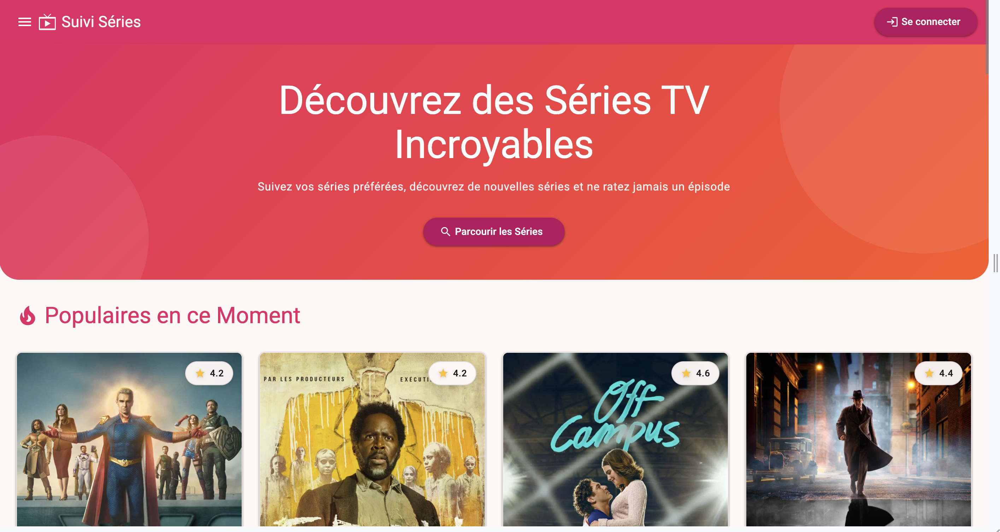
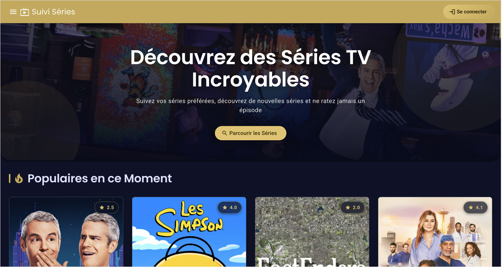

# 🕰️ Design History

This document traces the visual evolution of **Suivi Séries** across successive redesigns,
as product memory and a reference for future iterations.

---

## 📑 Table of Contents

1. [V1 — Light theme "Rose / Coral"](#v1--light-theme-rose--coral)
2. [V2 — Dark theme "Nuit & Or"](#v2--dark-theme-nuit--or-current)
3. [Comparison table](#comparison-table)
4. [Key decisions](#key-decisions)

---

## V1 — Light theme "Rose / Coral"

**Period**: initial version → May 2026.

First visual identity of the app, based on a **light** Material Design 3 theme:

- **Colors**: magenta-pink → coral gradient (`#e91e63` dominant) in the navigation bar and hero.
- **Background**: light surfaces (off-white / very pale pink).
- **Typography**: Roboto throughout (light-weight headings).
- **Hero**: static pink/coral gradient with circular decorative shapes.
- **Cards**: light rating badges (white translucent background).

**Identified limitations**: perceived as a "spreadsheet app" rather than a cinema/series
platform; the visual identity did not reflect the domain (films, TV series).

---

## V2 — Dark theme "Nuit & Or" (current)

**Period**: from May 2026.

Full cinematic redesign, conceived to immerse the user in the world of cinema and TV series
from the first page load, while maintaining a look close to native Material Design 3 and
staying easy to maintain.

- **Theme**: single dark (`color-scheme: dark`), deep night-blue surfaces (`#0e1227`).
- **Accent**: gold (`#c7a850` / `#e4c368`) — M3 palette generated via the `theme-color` schematic.
- **Typography**: **Poppins** (600) for headings/hero (cinematic display typeface), **Roboto** for body text.
- **Immersive hero**: dynamic TMDB backdrop from the most popular series as a background,
  with a dark gradient overlay + golden vignette and a subtle cinematic zoom.
- **Cards**: elevated surfaces + subtle border, golden glow on hover, "golden glass" rating badges.
- **Buttons**: gold-filled CTAs with active states in golden glass — always identifiable as buttons.
- **Polish**: golden scrollbar, golden text selection, font smoothing, `prefers-reduced-motion` respected.

See full details in [DESIGN_SYSTEM.md](../DESIGN_SYSTEM.md).

---

## Comparison table

| Criterion            | V1 — Rose / Coral             | V2 — Nuit & Or                          |
| -------------------- | ----------------------------- | --------------------------------------- |
| Mode                 | Light                         | Dark                                    |
| Dominant color       | Magenta pink `#e91e63`        | Night blue `#0e1227`                    |
| Accent               | Coral                         | Gold `#c7a850` / `#e4c368`              |
| Headings             | Roboto (light weight)         | Poppins 600 (display)                   |
| Hero                 | Static gradient               | Dynamic TMDB backdrop + vignette        |
| Cards                | Light, white badges           | Night-blue, golden glow & badge         |
| Perceived identity   | Generic / utilitarian         | Cinematic / immersive                   |
| `theme_color` PWA    | `#e91e63`                     | `#0c1024`                               |
| Favicon              | Former (pink)                 | Golden TV + play triangle               |

---

## Key decisions

- **Single dark theme (no light/dark toggle)**: deliberate choice for a strong identity
  and simplified maintenance (one set of tokens to manage).
- **Token-driven M3 palette** (`--mat-sys-*` + `light-dark()`): keeps rendering close to
  native Material Design and avoids brittle per-component overrides.
- **Poppins as display typeface**: adds cinematic character without bloating the bundle
  (only weights 400/500/600 are loaded).
- **Dynamic backdrop**: the hero background comes from the popular-series API (TMDB),
  reinforcing immersion without any static content to maintain.
